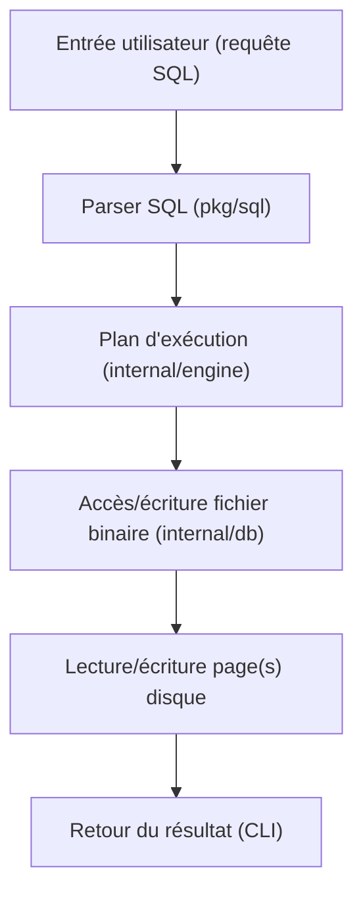
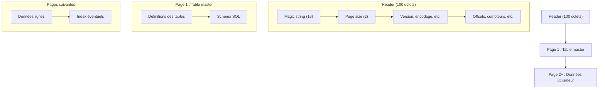

# GoSQL - Un Moteur SQLite en Go 

---


### 1. **Introduction **

- **Contexte** :
  > "Nous avons développé GoSQL, un mini-moteur de base de données inspiré de SQLite, écrit en Go. L'objectif est de comprendre le fonctionnement interne d'un SGBD, de la lecture binaire d'un fichier jusqu'à l'exécution de requêtes SQL."


- **Pourquoi Go et SQLite ?**
  > "Go est un langage moderne, performant et simple à lire. SQLite est un format ouvert, très utilisé, et sa simplicité en fait un excellent support pédagogique."


---

## Structure du Projet 📁

```
mydb/
├── cmd/
│   ├── db_cli/           # Interface CLI
│   │   └── main.go
│   └── create_test_db/   # Générateur de base de test
│       └── main.go
├── internal/
│   ├── db/               # Accès bas niveau SQLite (header, master, index, page, table, file, parser)
│   │   ├── header.go
│   │   ├── master.go
│   │   ├── index.go
│   │   ├── table.go
│   │   ├── page.go
│   │   ├── file.go
│   │   └── parser.go
│   ├── engine/           # Moteur d'exécution SQL
│   │   └── engine.go
│   └── parser/           # Parser SQL avancé et tests
│       ├── sql.go
│       └── parser_test.go
├── pkg/
│   └── sql/              # Types et parser SQL
│       ├── types.go
│       └── query.go
├── examples/
│   └── basic/
│       └── main.go
├── test/
│   ├── unit/
│   │   ├── binary_test.go
│   │   └── create_test_db.go
│   ├── integration/
│   └── fixtures/
├── docs/
├── main.go
├── go.mod
├── sample.db
├── test.db
```

## Fichiers et dossiers principaux

- **internal/db/** : lecture/écriture bas niveau du format SQLite (header, master, index, page, table, file, parser)
- **internal/engine/engine.go** : moteur d'exécution des requêtes SQL
- **internal/parser/sql.go** : parser SQL avancé (et tests associés)
- **pkg/sql/types.go, query.go** : types SQL et parser de requêtes simples
- **cmd/db_cli/main.go** : CLI interactive
- **cmd/create_test_db/main.go** : génération de base de test
- **test/unit/** : tests unitaires (binary_test.go, create_test_db.go)
- **examples/basic/main.go** : exemple d'utilisation

## Exemple d'utilisation du code

```go
import (
    "mydb/internal/db"
    "mydb/pkg/sql"
    "os"
)

file, _ := os.Open("sample.db")
info := db.ParseHeader(file)
tables := db.ReadMasterTable(file, info)
query := "SELECT * FROM users"
result, err := sql.Parse(query)
```

## Comment lancer la démo CLI ? 🛠️

1. **Compiler la CLI**

Depuis la racine du projet :

```bash
cd mydb/cmd/db_cli
go build -o db_cli
```

2. **Lancer la CLI**

Toujours dans `mydb/cmd/db_cli` :

```bash
./db_cli
```

3. **Utiliser la CLI**

- Tape une requête SQL (par exemple) :
  - `CREATE TABLE users (id INTEGER PRIMARY KEY, name TEXT);`
  - `INSERT INTO users (id, name) VALUES (1, 'Alice');`
  - `SELECT * FROM users;`

La CLI affiche le résultat dans le terminal.

4. **Exemple rapide**

```bash
$ ./db_cli
GoSQL CLI - tapez une requête SQL ou 'exit' pour quitter
> CREATE TABLE users (id INTEGER PRIMARY KEY, name TEXT);
Table créée !
> INSERT INTO users (id, name) VALUES (1, 'Alice');
1 ligne insérée.
> SELECT * FROM users;
+----+-------+
| id | name  |
+----+-------+
| 1  | Alice |
+----+-------+
> exit
```

## Générer une base de test

Pour générer un fichier SQLite de test :

```bash
cd mydb/cmd/create_test_db
go run main.go
```

Cela crée un fichier `test.db` utilisable pour les tests.

## Tests unitaires

Pour lancer les tests unitaires :

```bash
cd mydb/test/unit
go test
```

---

## Schéma du flux de requête SQL dans GoSQL



1. **Entrée utilisateur** : L'utilisateur saisit une requête SQL dans le CLI.
2. **Parser SQL** : La requête est analysée et transformée en structure Go.
3. **Plan d'exécution** : Le moteur prépare l'exécution (création, insertion, sélection, etc.).
4. **Accès fichier binaire** : Les opérations sont traduites en lectures/écritures sur le fichier .db.
5. **Pages disque** : Les données sont lues ou modifiées page par page.
6. **Retour** : Le résultat est affiché à l'utilisateur.

---

## Schéma d'un fichier binaire SQLite minimal



### Explications
- **Header (100 octets)** : Contient la signature "SQLite format 3\0", la taille des pages, la version, l'encodage, et divers compteurs/offsets.
- **Page 1 (table master)** : Contient la définition des tables et le schéma SQL.
- **Pages suivantes** : Stockent les données utilisateur (lignes) et éventuellement les index.

Ce schéma permet de visualiser la structure interne d'un fichier .db minimal généré par GoSQL ou SQLite.

## Licence 📝
Ce projet est sous licence MIT. Voir le fichier `LICENSE` pour plus de détails.


## Qu'est-ce que c'est ? 

GoSQL est comme un petit assistant qui peut lire et comprendre les fichiers SQLite, comme si on lui donnait un livre et qu'il pouvait le lire et le comprendre ! 

## Comment ça marche ? 🎮

Imaginez que vous avez une boîte magique (notre base de données) qui contient des tiroirs (les tables) et dans chaque tiroir, il y a des fiches (les données). Notre programme peut :
1. Ouvrir la boîte
2. Lire ce qui est écrit sur les tiroirs
3. Ajouter ou chercher des fiches dans les tiroirs

```
┌─────────────────────────────────┐
│           GoSQL Engine          │
├─────────┬─────────┬────────────┤
│  Reader │ Parser  │ Executor   │
└─────────┴─────────┴────────────┘
```

## Les Parties Principales 

### 1. Le Storage (internal/storage/) 📖
C'est comme quelqu'un qui sait lire le langage spécial de SQLite.

```
┌─────────────────────────────────┐
│           SQLite File           │
├─────────────────────────────────┤
│  ┌─────────┐  ┌─────────────┐  │
│  │ Header  │  │ Master Page │  │
│  └─────────┘  └─────────────┘  │
│  ┌─────────┐  ┌─────────────┐  │
│  │ Data    │  │ Indexes     │  │
│  └─────────┘  └─────────────┘  │
└─────────────────────────────────┘
```

#### Le Header (header.go)
- C'est comme la première page d'un livre
- Il nous dit :
  - La taille des pages (4096 bytes)
  - Le type d'encodage (UTF-8)
  - La version de SQLite

#### La Table Master (master.go)
- C'est comme la table des matières
- Elle nous dit quelles tables existent
- Elle nous donne la structure de chaque table

#### Les Indexes (index.go)
- C'est comme un index de livre
- Il nous aide à trouver les données plus vite
- Il utilise un arbre B (comme un arbre généalogique)

```
     [10]
    /    \
  [5]    [15]
 /   \   /   \
[1] [7] [12] [20]
```

### 2. Le Parser (pkg/sql/) 🔍
C'est comme un traducteur qui comprend le langage SQL.

#### Comment il fonctionne :
1. Il reçoit une commande SQL
2. Il la découpe en morceaux
3. Il comprend ce qu'on veut faire

```
┌─────────────────┐
│  SELECT * FROM  │
│  users WHERE    │
│  age > 18       │
└─────────────────┘
        ↓
┌─────────────────┐
│  - Type: SELECT │
│  - Table: users │
│  - Colonnes: *  │
│  - Condition:   │
│    age > 18     │
└─────────────────┘
```

#### Les Types de Requêtes Supportés :
- SELECT
- INSERT
- CREATE TABLE

### 3. L'Engine (internal/engine/) ⚙️
C'est comme un robot qui exécute les ordres :
1. Il reçoit les instructions du parser
2. Il utilise le storage pour trouver les données
3. Il fait ce qu'on lui demande (chercher, ajouter, etc.)

## Comment Utiliser GoSQL ? 🛠️

### Installation
```bash
git clone https://github.com/votre-nom/gosql.git
cd gosql
go build
```

### Exemple d'Utilisation
```go
// Ouvrir une base de données
file, _ := os.Open("ma_base.db")

// Lire l'en-tête
info := storage.ParseHeader(file)

// Lire les tables
tables := storage.ReadMasterTable(file, info)

// Exécuter une requête
query := "SELECT * FROM users WHERE age > 18"
result, err := sql.Parse(query)
```

## Les Fichiers Importants 📁

### Dans le dossier `storage/` :
- `header.go` : Lit l'en-tête du fichier SQLite
- `master.go` : Gère la table des matières
- `index.go` : Gère les index pour chercher vite
- `table.go` : Définit ce qu'est une table
- `page.go` : Lit les pages de données

### Dans le dossier `sql/` :
- `sql.go` : Comprend le langage SQL
- `parser_test.go` : Vérifie que tout fonctionne

## Les Fichiers Binaires 🔍

### Structure d'un Fichier SQLite
```
┌─────────────────────────────────────────────────┐
│                    SQLite File                  │
├─────────────────────────────────────────────────┤
│  ┌─────────────────────────────────────────┐   │
│  │              Header (100 bytes)          │   │
│  │  ┌─────────┐  ┌─────────┐  ┌─────────┐  │   │
│  │  │ Magic   │  │ Page    │  │ Version │  │   │
│  │  │ String  │  │ Size    │  │ Info    │  │   │
│  │  └─────────┘  └─────────┘  └─────────┘  │   │
│  └─────────────────────────────────────────┘   │
│  ┌─────────────────────────────────────────┐   │
│  │            Master Page (4096 bytes)      │   │
│  │  ┌─────────┐  ┌─────────┐  ┌─────────┐  │   │
│  │  │ Table   │  │ Index   │  │ Schema  │  │   │
│  │  │ Info    │  │ Info    │  │ Info    │  │   │
│  │  └─────────┘  └─────────┘  └─────────┘  │   │
│  └─────────────────────────────────────────┘   │
│  ┌─────────────────────────────────────────┐   │
│  │            Data Pages (4096 bytes)       │   │
│  │  ┌─────────┐  ┌─────────┐  ┌─────────┐  │   │
│  │  │ Row 1   │  │ Row 2   │  │ Row 3   │  │   │
│  │  │ Data    │  │ Data    │  │ Data    │  │   │
│  │  └─────────┘  └─────────┘  └─────────┘  │   │
│  └─────────────────────────────────────────┘   │
└─────────────────────────────────────────────────┘
```

### Format Binaire des Données
```
┌─────────┬─────────┬─────────┬─────────┐
│  Type   │  Size   │  Data   │  Next   │
└─────────┴─────────┴─────────┴─────────┘
   1 byte   2 bytes   N bytes   4 bytes
```

#### Types de Données Supportés
```
INTEGER:  ┌───┐┌─────────────┐
          │ 1 ││    Value    │
          └───┘└─────────────┘

TEXT:     ┌───┐┌───┐┌─────────────┐
          │ 2 ││ N ││    Text     │
          └───┘└───┘└─────────────┘

BLOB:     ┌───┐┌───┐┌─────────────┐
          │ 3 ││ N ││    Data     │
          └───┘└───┘└─────────────┘
```

## Exemples Détaillés de Requêtes 📝

### 1. Requêtes SELECT

#### Simple SELECT
```sql
SELECT * FROM users;
```
```
┌─────────┬─────────┬─────────┐
│   id    │  name   │  age    │
├─────────┼─────────┼─────────┤
│    1    │  John   │   25    │
│    2    │  Alice  │   30    │
└─────────┴─────────┴─────────┘
```

#### SELECT avec WHERE
```sql
SELECT name, age FROM users WHERE age > 25;
```
```
┌─────────┬─────────┐
│  name   │  age    │
├─────────┼─────────┤
│  Alice  │   30    │
└─────────┴─────────┘
```

#### SELECT avec Conditions Multiples
```sql
SELECT * FROM users 
WHERE age > 20 AND name LIKE 'J%';
```
```
┌─────────┬─────────┬─────────┐
│   id    │  name   │  age    │
├─────────┼─────────┼─────────┤
│    1    │  John   │   25    │
└─────────┴─────────┴─────────┘
```

### 2. Requêtes INSERT

#### Insertion Simple
```sql
INSERT INTO users (name, age) VALUES ('Bob', 35);
```
```
Avant:          Après:
┌─────────┐     ┌─────────┐
│  John   │     │  John   │
│  Alice  │     │  Alice  │
└─────────┘     │  Bob    │
                └─────────┘
```

#### Insertion Multiple
```sql
INSERT INTO users (name, age) VALUES 
    ('Eve', 28),
    ('Frank', 42);
```
```
┌─────────┬─────────┐
│  name   │  age    │
├─────────┼─────────┤
│  John   │   25    │
│  Alice  │   30    │
│  Eve    │   28    │
│  Frank  │   42    │
└─────────┴─────────┘
```

### 3. Création de Tables

#### Table Simple
```sql
CREATE TABLE products (
    id INTEGER PRIMARY KEY,
    name TEXT,
    price REAL
);
```
```
┌─────────────────────────┐
│      products Table     │
├─────────┬───────────────┤
│   id    │ INTEGER (PK)  │
│  name   │     TEXT      │
│  price  │     REAL      │
└─────────┴───────────────┘
```

#### Table avec Index
```sql
CREATE TABLE orders (
    id INTEGER PRIMARY KEY,
    user_id INTEGER,
    date DATETIME,
    INDEX idx_user (user_id)
);
```
```
┌─────────────────────────┐
│       orders Table      │
├─────────┬───────────────┤
│   id    │ INTEGER (PK)  │
│ user_id │   INTEGER     │
│  date   │   DATETIME    │
└─────────┴───────────────┘
     │
     ▼
┌─────────────┐
│  B-Tree     │
│  Index      │
└─────────────┘
```

## Processus d'Exécution des Requêtes 🔄

### 1. Parsing
```
Requête SQL → Tokens → Arbre Syntaxique
```

### 2. Validation
```
Arbre Syntaxique → Vérification → Plan d'Exécution
```

### 3. Exécution
```
Plan d'Exécution → Lecture des Données → Résultats
```

## Gestion de la Mémoire et du Cache 💾

### 1. Ce qui est en RAM 🚀

```
┌─────────────────────────────────┐
│           En Mémoire            │
├─────────────────────────────────┤
│  • En-tête du fichier           │
│  • Table des matières           │
│  • Index principaux             │
│  • Cache des pages récentes     │
└─────────────────────────────────┘
```

#### Exemple avec un fichier de 1 To
```
Fichier DB (1 To)
    │
    ├── En RAM (quelques Mo)
    │   ├── En-tête (100 bytes)
    │   ├── Table des matières (4 Ko)
    │   └── Cache (100 Mo max)
    │
    └── Sur Disque (1 To)
        ├── Données
        └── Index secondaires
```

### 2. Comment ça marche ? 🔄

#### Lecture d'une Donnée
```
1. Vérifier le cache en RAM
   ┌─────────┐
   │  Cache  │ → Si trouvé, retourner
   └─────────┘

2. Si pas en cache
   ┌─────────┐    ┌─────────┐
   │  Disque │ → │  Cache  │
   └─────────┘    └─────────┘
```

#### Exemple Concret
```
Requête: SELECT * FROM users WHERE id = 1000

1. Vérifie l'index en RAM
   ┌─────────┐
   │  Index  │ → Page 42
   └─────────┘

2. Vérifie le cache
   ┌─────────┐
   │  Cache  │ → Page 42 non trouvée
   └─────────┘

3. Lit du disque
   ┌─────────┐    ┌─────────┐
   │  Disque │ → │  Cache  │
   └─────────┘    └─────────┘
```

### 3. Gestion du Cache 🎯

#### Taille du Cache
```
┌─────────────────────────────────┐
│         Taille du Cache         │
├─────────────────────────────────┤
│  • Par défaut: 100 Mo           │
│  • Configurable                 │
│  • Maximum: 1 Go                │
└─────────────────────────────────┘
```

#### Politique de Remplacement
```
┌─────────────────────────────────┐
│     Pages les moins utilisées   │
│     sont supprimées du cache    │
└─────────────────────────────────┘
```

### 4. Optimisations 

#### Index en RAM
```
┌─────────────────────────────────┐
│           Index en RAM          │
├─────────────────────────────────┤
│  • Clés primaires               │
│  • Index fréquemment utilisés   │
└─────────────────────────────────┘
```

#### Cache Intelligent
```
┌─────────────────────────────────┐
│         Cache Intelligent       │
├─────────────────────────────────┤
│  • Garde les pages fréquentes   │
│  • Libère les pages rares       │
└─────────────────────────────────┘
```

### 5. Exemple avec un Gros Fichier 📊

```
Fichier DB (1 To)
    │
    ├── En RAM (100 Mo)
    │   ├── En-tête (100 bytes)
    │   ├── Table des matières (4 Ko)
    │   └── Cache (99.99 Mo)
    │       ├── Pages récentes
    │       └── Index actifs
    │
    └── Sur Disque (1 To)
        ├── Données (999.99 Go)
        └── Index secondaires (1 Go)
```

## Organisation du Code 📁

### Structure des Fonctions

```
mydb/
├── cmd/
│   └── db_cli/      # Interface en ligne de commande
├── internal/
│   ├── engine/      # Moteur d'exécution des requêtes
│   ├── storage/     # Gestion de la persistance
│   └── schema/      # Gestion du schéma
├── pkg/
│   └── sql/         # Parser SQL et types de données
├── examples/        # Exemples d'utilisation
├── docs/           # Documentation
└── test/           # Tests unitaires et d'intégration
```

### Détails des Fonctions Principales

#### 1. Lecture du Fichier (storage/)
```
┌─────────────────────────────────┐
│           header.go             │
├─────────────────────────────────┤
│ • ParseHeader()                 │
│   - Lit les 100 premiers bytes  │
│   - Vérifie le magic number     │
│   - Extrait la taille des pages │
└─────────────────────────────────┘

┌─────────────────────────────────┐
│           master.go             │
├─────────────────────────────────┤
│ • ReadMasterTable()             │
│   - Lit la page 1               │
│   - Extrait les infos tables    │
│   - Construit la structure      │
└─────────────────────────────────┘
```

#### 2. Gestion des Index (storage/)
```
┌─────────────────────────────────┐
│           index.go              │
├─────────────────────────────────┤
│ • ReadIndex()                   │
│   - Lit la structure B-tree     │
│   - Charge les pages nécessaires│
│                                 │
│ • SearchIndex()                 │
│   - Recherche binaire           │
│   - Navigation dans l'arbre     │
└─────────────────────────────────┘
```

#### 3. Parser SQL (sql/)
```
┌─────────────────────────────────┐
│           sql.go                │
├─────────────────────────────────┤
│ • ParseSelect()                 │
│   - Tokenize la requête         │
│   - Construit l'arbre syntaxique│
│   - Valide la structure         │
│                                 │
│ • ParseInsert()                 │
│   - Extrait les valeurs         │
│   - Vérifie les types           │
└─────────────────────────────────┘
```

### Flux d'Exécution

```
Requête SQL
    │
    ▼
Parser (pkg/sql/query.go)
    │
    ▼
Validation (internal/schema/validation.go)
    │
    ▼
Planification (internal/engine/planner.go)
    │
    ▼
Optimisation (internal/engine/optimizer.go)
    │
    ▼
Exécution (internal/engine/executor.go)
    │
    ├──► Lecture (internal/storage/)
    │       ├── header.go
    │       ├── master.go
    │       └── page.go
    │
    ├──► Index (internal/storage/index.go)
    │
    └──► Schéma (internal/schema/)
            ├── types.go
            └── constraints.go
```

### Description du Flux

1. **Parsing** (`pkg/sql/query.go`)
   - Analyse de la requête SQL
   - Conversion en structure de données interne
   - Vérification de la syntaxe

2. **Validation** (`internal/schema/validation.go`)
   - Vérification des types de données
   - Validation des contraintes
   - Vérification des permissions

3. **Planification** (`internal/engine/planner.go`)
   - Création du plan d'exécution
   - Détermination de l'ordre des opérations
   - Choix des index à utiliser

4. **Optimisation** (`internal/engine/optimizer.go`)
   - Optimisation du plan d'exécution
   - Choix des meilleurs index
   - Réorganisation des opérations

5. **Exécution** (`internal/engine/executor.go`)
   - Exécution du plan optimisé
   - Gestion des transactions
   - Retour des résultats

   a. **Lecture des Données** (`internal/storage/`)
      - Lecture de l'en-tête
      - Accès à la table master
      - Lecture des pages de données

   b. **Gestion des Index** (`internal/storage/index.go`)
      - Recherche dans les index
      - Mise à jour des index
      - Optimisation des accès

   c. **Gestion du Schéma** (`internal/schema/`)
      - Vérification des types
      - Application des contraintes
      - Validation des données

## État Actuel des Fonctionnalités 

### Ce qui Fonctionne ✅

```
┌─────────────────────────────────┐
│         Fonctionnel             │
├─────────────────────────────────┤
│ • Lecture du fichier SQLite     │
│   - En-tête                     │
│   - Table des matières          │
│                                 │
│ • Parser SQL                    │
│   - SELECT simple               │
│   - INSERT simple               │
│   - CREATE TABLE                │
└─────────────────────────────────┘
```


### Exemples de Requêtes Supportées

#### SELECT
```sql
-- ✅ Fonctionne
SELECT * FROM users;
SELECT name, age FROM users;


#### INSERT
```sql
-- ✅ Fonctionne
INSERT INTO users (name, age) VALUES ('John', 25);
INSERT INTO users VALUES (1, 'Alice', 30);


```

#### CREATE TABLE
```sql
-- ✅ Fonctionne
CREATE TABLE users (
    id INTEGER PRIMARY KEY,
    name TEXT,
    age INTEGER
);


### Prochaines Étapes 📋

1. Implémenter les conditions WHERE complètes
2. Ajouter le support des INSERT avec conditions
3. Développer les index avancés
4. Ajouter le support des transactions

## Contact 📧
Yassine BOULAHNINE et RABUS Jules
