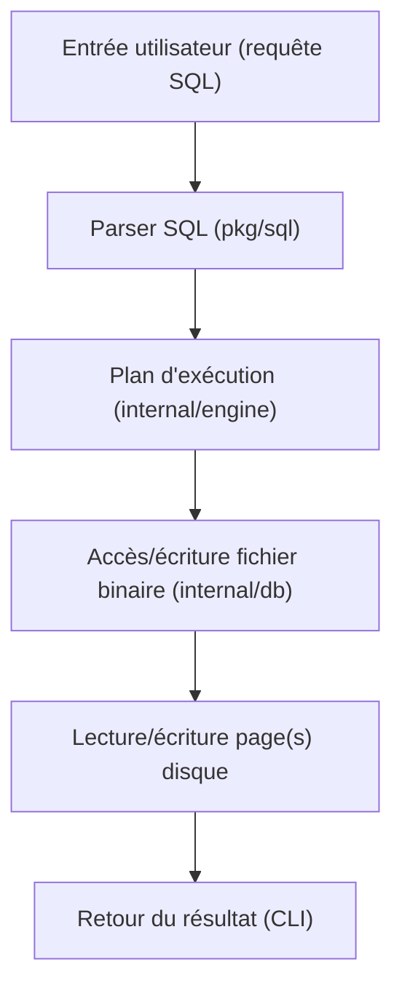
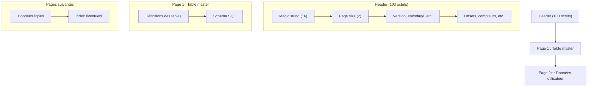

# GoSQL - Un Moteur SQLite en Go 🚀

---

## Préparer la soutenance du projet 🗣️

### 1. **Introduction à donner à l'oral**

- **Contexte** :
  > "Nous avons développé GoSQL, un mini-moteur de base de données inspiré de SQLite, écrit en Go. L'objectif est de comprendre le fonctionnement interne d'un SGBD, de la lecture binaire d'un fichier jusqu'à l'exécution de requêtes SQL."


- **Pourquoi Go et SQLite ?**
  > "Go est un langage moderne, performant et simple à lire. SQLite est un format ouvert, très utilisé, et sa simplicité en fait un excellent support pédagogique."


---

## Structure du Projet 📁

```
mydb/
├── cmd/
│   ├── db_cli/           # Interface CLI
│   │   └── main.go
│   └── create_test_db/   # Générateur de base de test
│       └── main.go
├── internal/
│   ├── db/               # Accès bas niveau SQLite (header, master, index, page, table, file, parser)
│   │   ├── header.go
│   │   ├── master.go
│   │   ├── index.go
│   │   ├── table.go
│   │   ├── page.go
│   │   ├── file.go
│   │   └── parser.go
│   ├── engine/           # Moteur d'exécution SQL
│   │   └── engine.go
│   └── parser/           # Parser SQL avancé et tests
│       ├── sql.go
│       └── parser_test.go
├── pkg/
│   └── sql/              # Types et parser SQL
│       ├── types.go
│       └── query.go
├── examples/
│   └── basic/
│       └── main.go
├── test/
│   ├── unit/
│   │   ├── binary_test.go
│   │   └── create_test_db.go
│   ├── integration/
│   └── fixtures/
├── docs/
├── main.go
├── go.mod
├── sample.db
├── test.db
```

## Fichiers et dossiers principaux

- **internal/db/** : lecture/écriture bas niveau du format SQLite (header, master, index, page, table, file, parser)
- **internal/engine/engine.go** : moteur d'exécution des requêtes SQL
- **internal/parser/sql.go** : parser SQL avancé (et tests associés)
- **pkg/sql/types.go, query.go** : types SQL et parser de requêtes simples
- **cmd/db_cli/main.go** : CLI interactive
- **cmd/create_test_db/main.go** : génération de base de test
- **test/unit/** : tests unitaires (binary_test.go, create_test_db.go)
- **examples/basic/main.go** : exemple d'utilisation

## Exemple d'utilisation du code

```go
import (
    "mydb/internal/db"
    "mydb/pkg/sql"
    "os"
)

file, _ := os.Open("sample.db")
info := db.ParseHeader(file)
tables := db.ReadMasterTable(file, info)
query := "SELECT * FROM users"
result, err := sql.Parse(query)
```

## Comment lancer la démo CLI ? 🛠️

1. **Compiler la CLI**

Depuis la racine du projet :

```bash
cd mydb/cmd/db_cli
go build -o db_cli
```

2. **Lancer la CLI**

Toujours dans `mydb/cmd/db_cli` :

```bash
./db_cli
```

3. **Utiliser la CLI**

- Tape une requête SQL (par exemple) :
  - `CREATE TABLE users (id INTEGER PRIMARY KEY, name TEXT);`
  - `INSERT INTO users (id, name) VALUES (1, 'Alice');`
  - `SELECT * FROM users;`

La CLI affiche le résultat dans le terminal.

4. **Exemple rapide**

```bash
$ ./db_cli
GoSQL CLI - tapez une requête SQL ou 'exit' pour quitter
> CREATE TABLE users (id INTEGER PRIMARY KEY, name TEXT);
Table créée !
> INSERT INTO users (id, name) VALUES (1, 'Alice');
1 ligne insérée.
> SELECT * FROM users;
+----+-------+
| id | name  |
+----+-------+
| 1  | Alice |
+----+-------+
> exit
```

## Générer une base de test

Pour générer un fichier SQLite de test :

```bash
cd mydb/cmd/create_test_db
go run main.go
```

Cela crée un fichier `test.db` utilisable pour les tests.

## Tests unitaires

Pour lancer les tests unitaires :

```bash
cd mydb/test/unit
go test
```

---

## Schéma du flux de requête SQL dans GoSQL



1. **Entrée utilisateur** : L'utilisateur saisit une requête SQL dans le CLI.
2. **Parser SQL** : La requête est analysée et transformée en structure Go.
3. **Plan d'exécution** : Le moteur prépare l'exécution (création, insertion, sélection, etc.).
4. **Accès fichier binaire** : Les opérations sont traduites en lectures/écritures sur le fichier .db.
5. **Pages disque** : Les données sont lues ou modifiées page par page.
6. **Retour** : Le résultat est affiché à l'utilisateur.

---

## Schéma d'un fichier binaire SQLite minimal



### Explications
- **Header (100 octets)** : Contient la signature "SQLite format 3\0", la taille des pages, la version, l'encodage, et divers compteurs/offsets.
- **Page 1 (table master)** : Contient la définition des tables et le schéma SQL.
- **Pages suivantes** : Stockent les données utilisateur (lignes) et éventuellement les index.

Ce schéma permet de visualiser la structure interne d'un fichier .db minimal généré par GoSQL ou SQLite.

## Licence 📝
Ce projet est sous licence MIT. Voir le fichier `LICENSE` pour plus de détails.
